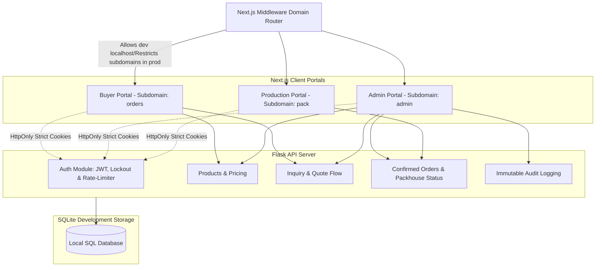
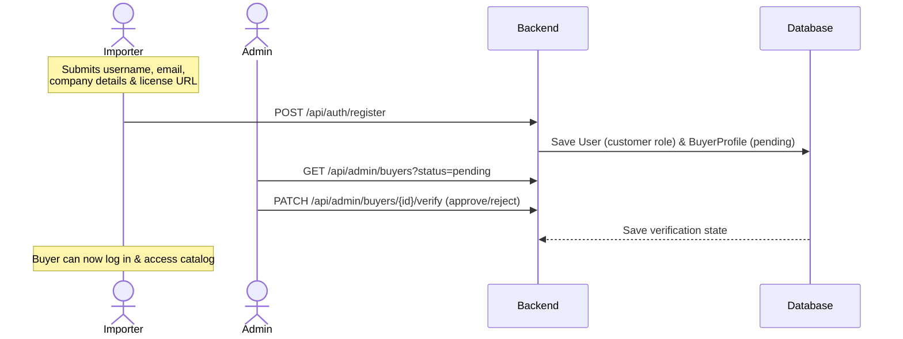
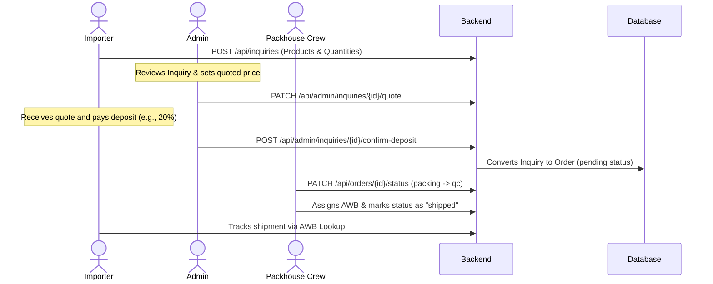

# Dylaan — Premium B2B Agriculture Export Portal

Dylaan is a full-stack, enterprise-grade B2B e-commerce and logistics platform tailored for agricultural exports, specifically focusing on fresh flowers and leaves. The platform bridges the gap between buyers (importers), administrative oversight (quote management & compliance), and the packhouse/QC floor.

It features a multi-portal architecture secured by role-specific stateless JWTs, domain-level route isolation, rate-limiting, brute-force protection, and an append-only audit trail.

---

## 🎨 Design & Aesthetics
Dylaan utilizes a premium, high-contrast dark green (`#021A1A`) and teal color palette to evoke an enterprise agricultural feel. The UI incorporates sleek glassmorphism effects, ensuring a frictionless, modern, and highly legible experience across all management portals.

---

## 🏗️ System Architecture



### Domain-Based Route Isolation
In production, Next.js Middleware isolates portals by subdomain to restrict exposure:
*   **Buyer Portal** (`orders.yourco.com`): Limits access strictly to public homepage, product inquiries, and AWB tracking. Attempts to access admin or production paths return a `404 Not Found` to obscure route existence.
*   **Admin Portal** (`admin.yourco.internal`): Allow admin paths; block packhouse/production pages. Explicit login gatekeeping prevents unauthorized lateral movement.
*   **Production Portal** (`pack.yourco.internal`): Allow packhouse/packing crew paths; block admin pages. Explicit login gatekeeping.

*Note: In development (`localhost:3000`), Next.js middleware permits access to all portals under one origin for testing, ensuring `SameSite=Strict` cookies are successfully passed between frontend and backend.*

---

## 💻 Portal Breakdown

### 1. 🛍️ Buyer (Customer) Portal
*   **Self-Registration**: Buyers register by submitting company profiles and uploading importer documents (e.g., to AWS S3).
*   **AWB Logistics Radar**: Public-facing shipment lookup using Airway Bill (AWB) numbers to track flight statuses.
*   **Catalog Exploration**: Browse flowers (e.g., *Lotus*, *Panneer Rose*, *Sampanki*) and leaves (e.g., *Curry Leaves*, *Banana Leaves*, *Neem*) once verified.
*   **Inquiry System**: Submit request-for-quotes. Restricted to a maximum of 3 active inquiries concurrently.

### 2. 🛡️ Admin Dashboard
*   **Staff Management**: Administrators can dynamically provision new internal staff accounts, assigning them either `admin` or `packhouse` roles directly from the interface.
*   **Buyer Compliance**: Review registrations, check importer licenses, and approve or reject profiles.
*   **Product Pricing**: Adjust unit prices for flowers and leaves catalog. (Prices are hidden from buyers until custom quotes are approved).
*   **Quote Engine**: Review active inquiries, calculate totals, specify deposit requirements (typically 10-30%), and issue quotes.
*   **Deposit Confirmation**: Verify manual/transaction deposits to convert approved quotes into active production orders.
*   **Security & Audit Trail**: Monitor operations via the read-only, paginated audit log.

### 3. 📦 Production & Packhouse Portal
*   **Priority Queue**: View active orders sorted by time and priority level.
*   **Status Workflow**: Manage physical order flow stages:
    $$\text{Pending} \rightarrow \text{Packing} \rightarrow \text{QC (Quality Control)} \rightarrow \text{Shipped} \rightarrow \text{Delivered}$$
*   **AWB Management**: Assign flight details, airway bills, and coordinate logistics.

---

## 🔄 Transaction & Verification Flows

### A. Importer Onboarding Flow


### B. Inquiry to Order & Ship Flow


---

## 🔒 Security & Portal Protection
1.  **HttpOnly Cookies**: JWT tokens are securely issued as `HttpOnly`, `Secure`, and `SameSite=Strict` cookies to completely neutralize XSS (Cross-Site Scripting) attacks. JWTs are completely hidden from Javascript execution.
2.  **Stateless Role Validation**: API utilizes JSON Web Tokens containing role claims (`customer`, `admin`, `packhouse`). Token expiries are set conservatively based on duties:
    *   `customer`: **24 hours**
    *   `admin`: **4 hours**
    *   `packhouse`: **12 hours** (covers standard shift duration)
3.  **Brute-Force Lockout**: Tracks failed login attempts per user. Accounts are locked for **15 minutes** after 5 sequential failures.
4.  **Rate Limiting**: Custom API rate limit rules based on endpoints (e.g., registration limited to 5 attempts/hour; general login limited to 20 attempts/minute).
5.  **Immutable Auditing**: An append-only audit trail logging user, timestamp, actions (e.g. `product.update`, `order.status_change`), and JSON diff payloads. Exposed purely through write-once logic; updates/deletions on `AuditLog` are not possible via the API.
6.  **Zero Trust Architecture**: Admin (`admin.dylaan.internal`) and Production (`pack.dylaan.internal`) portals must be locked behind VPN/VPC overlays like Cloudflare Zero Trust. They should not be directly accessible via the public internet.

---

## 💳 Payment Strategy: UK & EU B2B Optimization
Because the target market is **London, UK**, high-value agricultural shipments utilize a hybrid B2B payment model to eliminate excessive credit card cross-border fees.

1.  **Deposit / Milestone Escrow (Tazapay or Stripe)**
    - For initial packing milestone deposits (10-30%), we utilize Tazapay or Stripe integrated with **BACS**, **UK Faster Payments**, or **SEPA**. This ensures instantaneous liquidity to begin operational workflows in the packhouse.
2.  **Final Balance Settlement (Wise Business / Stripe Treasury)**
    - Final balance clearing leverages **Virtual Bank Accounts (vIBANs)** to offer clients a local sort code and account number, facilitating SWIFT/Wire zero-fee routing for large ticket invoices upon arrival.

---

## 🛠️ Technology Stack

*   **Frontend**: Next.js 16 (App Router), TypeScript, Tailwind CSS v4, `@tailwindcss/postcss`. Dev indicators are disabled for distraction-free UI testing.
*   **Backend**: Python 3.x, Flask, Flask-SQLAlchemy (ORM), Flask-Cors, PyJWT.
*   **Database**: SQLite (Development) / PostgreSQL-ready.

---

## 📂 Project Structure

```
dylaan/
├── backend/                  # Flask REST API
│   ├── instance/             # SQLite database instance
│   ├── venv/                 # Python Virtual Environment
│   ├── app.py                # Main Flask App & Router endpoints
│   ├── extensions.py         # SQLAlchemy Setup
│   ├── models.py             # Database Models
│   ├── requirements.txt      # Python dependencies
│   └── test_security.py      # Security unit test suite
├── frontend/                 # Next.js Application
│   ├── src/
│   │   ├── app/              # Next.js App Router (Layouts & Pages)
│   │   │   ├── admin/        # Admin portal
│   │   │   ├── production/   # Production portal
│   │   │   ├── globals.css   # Main CSS styling
│   │   │   └── page.tsx      # Buyer Homepage & AWB search
│   │   ├── middleware.ts     # Domain routing logic
│   ├── next.config.ts        # Next.js App Configuration
│   ├── package.json          # Node dependencies
│   └── tsconfig.json         # TypeScript configuration
└── README.md                 # Project Documentation (This file)
```

---

## 🚀 Getting Started

### 1. Prerequisites
Ensure you have the following installed locally:
*   [Node.js (v18+)](https://nodejs.org)
*   [Python (3.8+)](https://www.python.org)

### 2. Backend Setup
1.  Navigate to the backend directory:
    ```bash
    cd backend
    ```
2.  Set up the virtual environment:
    ```bash
    python -m venv venv
    ```
3.  Activate the virtual environment:
    *   **Windows (PowerShell)**: `.\venv\Scripts\Activate.ps1`
    *   **Mac/Linux**: `source venv/bin/activate`
4.  Install dependencies:
    ```bash
    pip install -r requirements.txt
    ```
5.  Run the Flask API Server:
    ```bash
    python app.py
    ```
    *The API will start at `http://127.0.0.1:5000` and automatically populate seed data if the database is empty.*

### 3. Frontend Setup
1.  Navigate to the frontend directory:
    ```bash
    cd ../frontend
    ```
2.  Install dependencies:
    ```bash
    npm install
    ```
3.  Run the development server:
    ```bash
    npm run dev
    ```
    *The site will start at `http://localhost:3000`.*

---

## 🔑 Seed Accounts & Credentials

The development database is automatically seeded with default credentials for quick testing. Admins can create additional staff accounts via the Staff Management tab in the Admin portal.

| Username | Password | Role | Access / Portal Path |
| :--- | :--- | :--- | :--- |
| `customer` | `demo123` | Customer | Buyer Portal (`/`) - Approved Profile |
| `admin` | `admin123` | Administrator | Admin Dashboard (`/admin`) |
| `packhouse` | `pack123` | Production Crew | Production Queue (`/production`) |